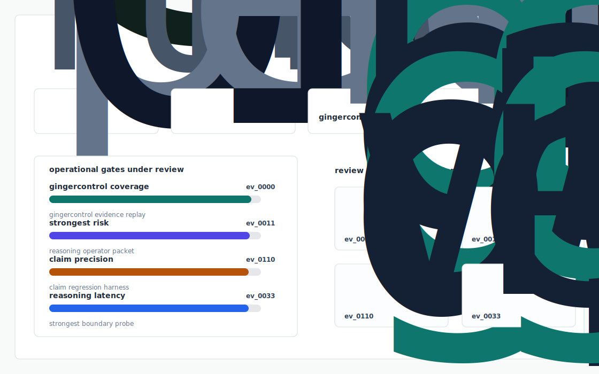
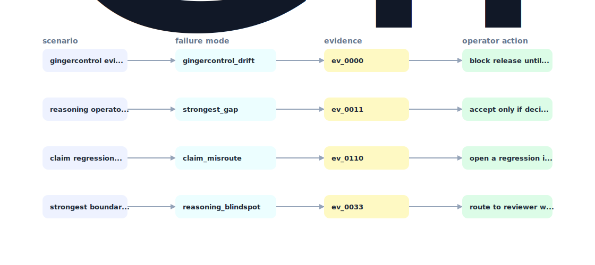

# Hts Bench

The first public, reasoning aware HTS classification benchmark - built on CROSS rulings, scored on both code accuracy and GRI citation fidelity.



## Why it exists

GingerControl's strongest claim is reasoning grade HTS classification with full GRI audit trails.

Most internal demos stop at a pretty chart. This repository is built around the harder part: a repeatable path from fixture, to failure, to evidence, to the operator action a serious team would actually trust.

## What is inside

- A deterministic replay harness tuned around gingercontrol, strongest, and claim.
- Company-specific strategy code in `src/hts_bench/strategy.py`, not just README-level customization.
- Citation-locked reports where every decision claim has to point back to a generated evidence ID.
- Two visual artifacts generated from the latest run: `outputs/project_working.svg` and `outputs/evidence_map.svg`.
- A portable demo pack with JSON, CSV, Markdown, HTML, SVG, and benchmark artifacts.



## Signals it measures

- `gingercontrol coverage`
- `strongest risk`
- `claim precision`
- `reasoning latency`

## Failure modes it plants

- gingercontrol drift
- strongest gap
- claim misroute
- reasoning blindspot

## Run it locally

```bash
uv sync
uv run hts-bench all
uv run pytest -q
uv run ruff check .
```

## Outputs worth opening

- `outputs/dashboard.html`
- `outputs/project_working.svg`
- `outputs/evidence_map.svg`
- `outputs/operator_brief.md`
- `outputs/decision_report.md`
- `outputs/strategy_model.json`
- `outputs/demo_pack.zip`

## Sources

- https://gingercontrol.com/blog/ai-trade-compliance
- https://gingercontrol.com/blog/automated-hts-code-classification-tools
- https://gingercontrol.com/blog/hs-code-classification-marketplace
- https://gingercontrol.com/about
- https://www.gingercontrol.com/services/features
- https://www.trysignalbase.com/news/funding/gingercontrol-secures-21m-seed
- https://www.backed.vc/portfolio/ginger-control
- https://www.crunchbase.com/organization/gingercontrol
- https://rulings.cbp.gov/
- https://www.linkedin.com/in/chen-cui-6853271b8/

## Boundary

Everything runs locally against synthetic fixtures. There are no credentials, no customer records, no outreach files, and no hosted API dependency.
